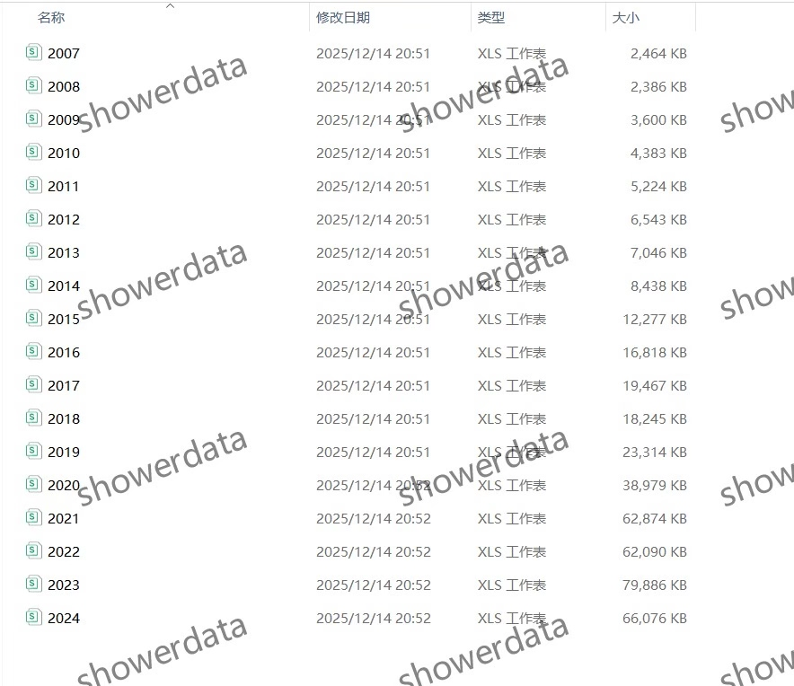
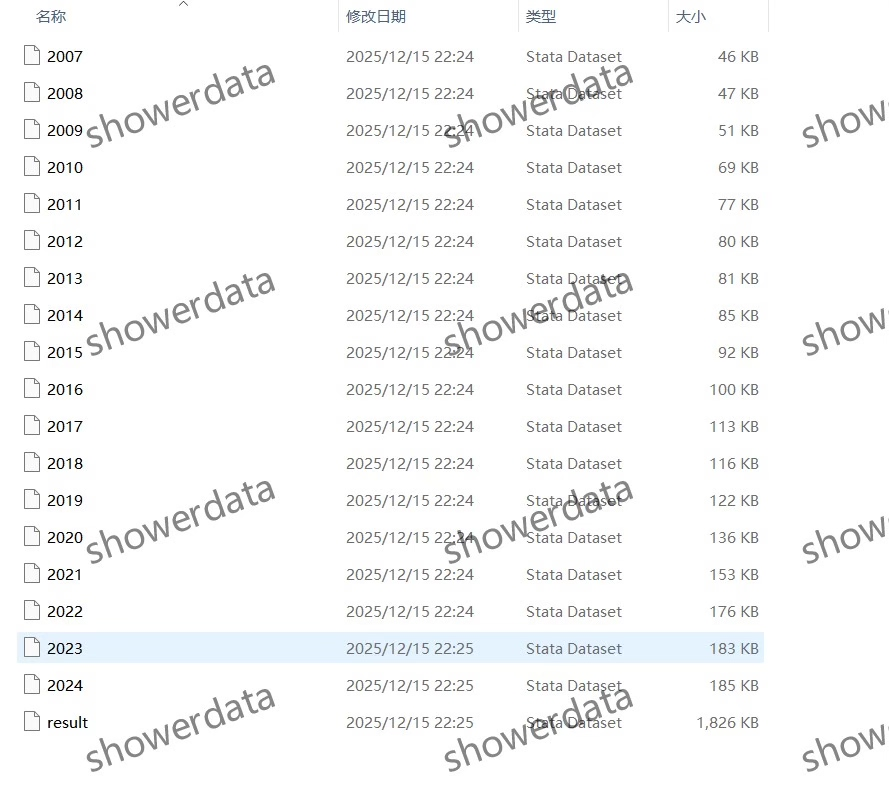
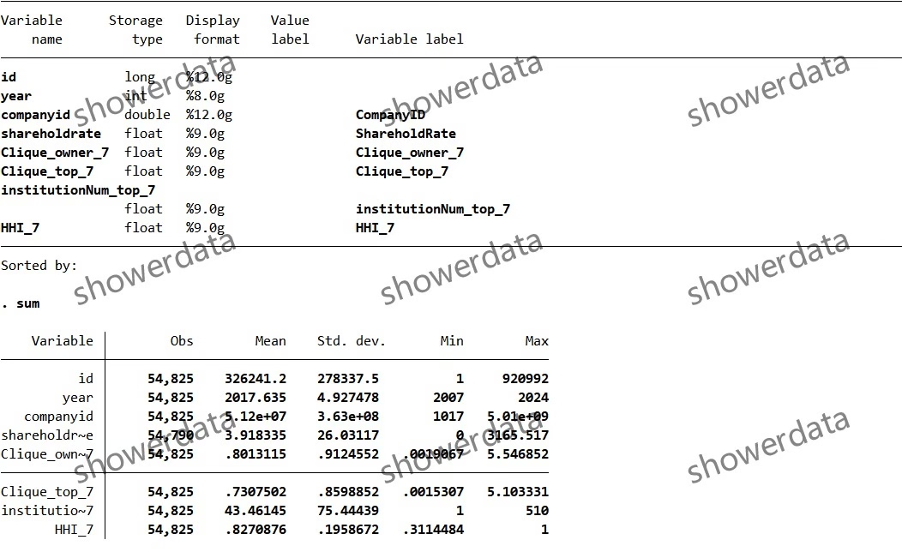
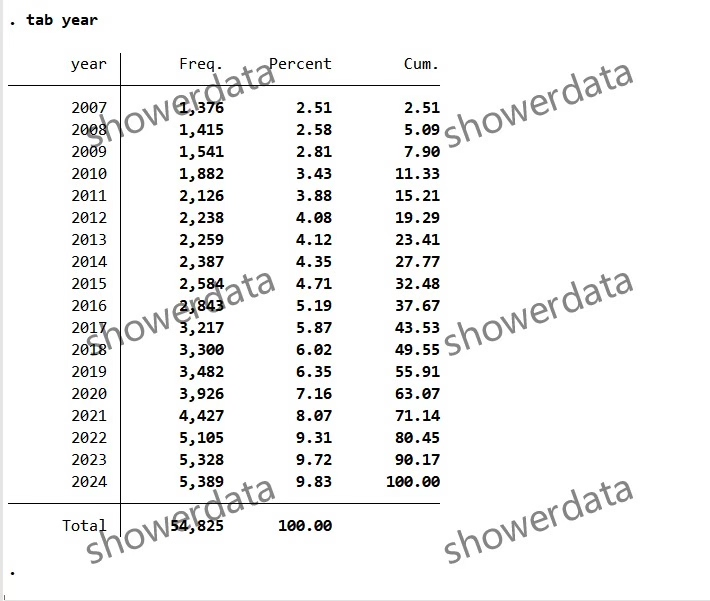
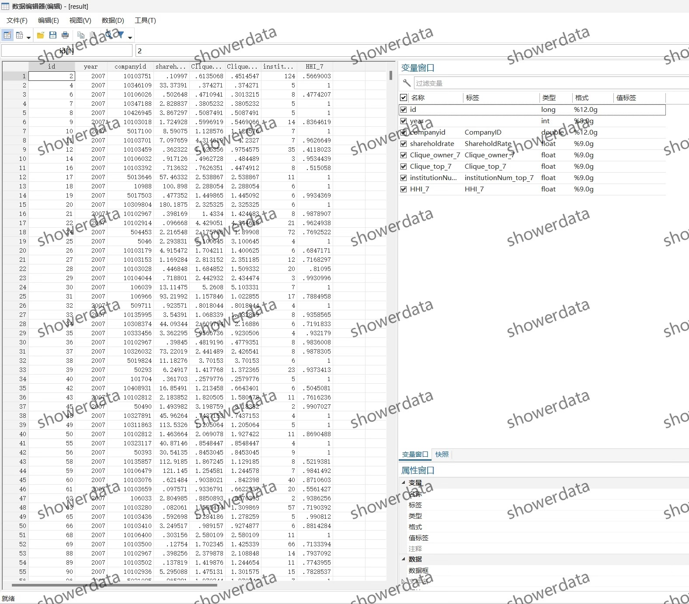
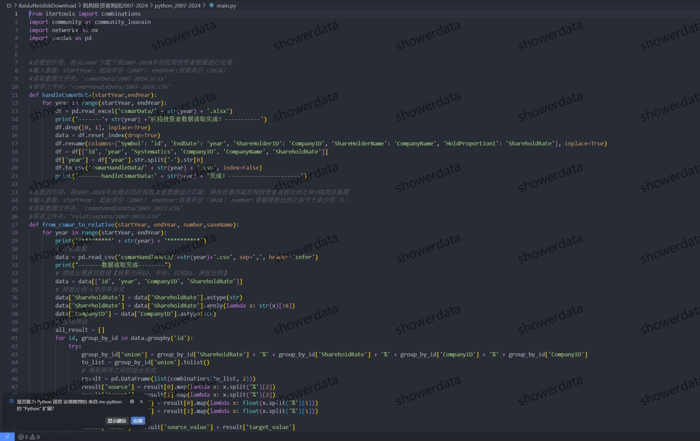
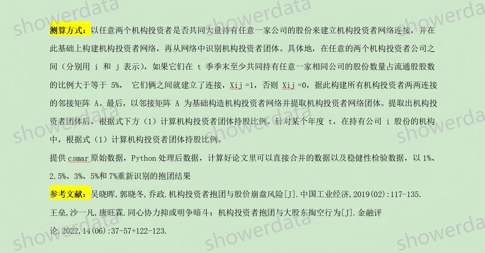

## Body

（2007-2025年）上市公司-机构投资者抱团数据

一、数据介绍
（1）数据详情：（截图为07-24年老数据截图，供参考，方法与新数据一样）见下方图片，拍前请看清楚！已展示说明，请确定好是不是自己需要的再拍下，如有疑问请买前问清！发货后任何理由不退不换！拍前请确认自己会使用再拍，不提供答疑，谢谢！代码复现需要使用者有一定专业水平，且可能对设备性能有要求，不保证能复现，介意勿拍！数据可能会有客观原因所致缺失值，介意勿拍，谢谢！
（2）数据名称：上市公司-机构投资者抱团数据
（3）样本范围：A鼓尚视公司
（4）时间范围：2007-2025年
（5）结果数据格式：excel、dta
（6）数据内容：结果、原始数据、代码（python与do文档都有）
（7）原始数据来源：csm/ar

二、数据结果指标如图所示

三、计算方法如图所示

四、参考文献如图所示

## Images

Here is a pay link on Stripe ( https://buy.stripe.com/3cs8yP7sY87d0vu9AB ). Please contact me lonlonago@foxmail.com after funding $89, and I will send you a complete data files , thank you!

